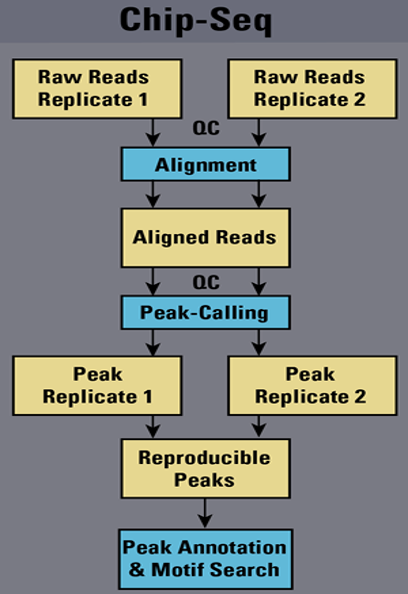

# ChIP Next Generation Sequencing Analysis

## 0. Workflow



#### Required software:

```bash
conda config --add channels bioconda
conda config --add channels conda-forge
conda install macs3 -y
conda install fastqc -y
conda install bowtie2 -y
conda install samtools -y
conda install samtools -y
```

## 1. Quality assessment with FastQC

Generate a HTML report of ChIPseq library QC:

1. Run the command `fastqc original_fastq_data/fastinput.fastq.gz`. You could also use a wildcard command `fastqc *.gz`.

2. FastQC report will be stored under `input_fastqc.html`.

## 2. Alignment

Perform alignment of reads to the genome using Bowtie2

### Alignment to the genome: creating a Bowtie2 index

```bash
# If you have hg.19.fa file, create indexed genome.
bowtie2-build <path_to_reference_genome.fa> <prefix_to_name_indexes>
wget -c https://genome-idx.s3.amazonaws.com/hisat/hg19_genome.tar.gz
mkdir ./hg19
bowtie2-build --threads 5 hg19.fa ./hg19/hg19
```

Or use other versions of reference human or other species genomes (all Bowtie and Bowtie2 index compatible) and go to the [index zone](https://benlangmead.github.io/aws-indexes/bowtie), skipping building your indexes by relying on these resources.  

```bash
unzip hg19.zip -d hg19
bowtie2 -p 5 -q --local -x hg19/hg19 -U Input.fastq.gz -S Input_aln_unsorted.sam
```

The basic options for aligning reads to the genome using `Bowtie2` are:

- `-p`: number of processors / cores

Use `lscpu` to check the number of CPU cores. Leave 1 or 2 cores for the OS. This means that if you have 10 CPUs, use `-p 8`.

- `-q`: indicates reads are in FASTQ format
- `--local`: local alignment feature to perform [soft-clipping](https://sequencing.qcfail.com/articles/soft-clipping-of-reads-may-add-potentially-unwanted-alignments-to-repetitive-regions/#:~:text=Aligners reaching such high mapping,for the alignment as such.)
- `-x`: /path/to/genome_indices_directory *and* genome index base name

A genome base name is also required when we specify the path `-x hg19/hg19` rather than `-x hg19` which won't work!

- `-U`: /path/to/FASTQ_file (this can be compressed)
- `-S`: /path/to/output/SAM_file (inc. of file *name*)

## 3. Filtering

### SAM/BAM Explanation

[Sequence Alignment/Map format and SAMtools | Bioinformatics | Oxford Academic (oup.com)](https://academic.oup.com/bioinformatics/article/25/16/2078/204688?login=false)

*To include a multiple mapped read in the analysis, or not to include - that is the question?*

One of the key questions that a ChIPseq data analyst needs to consider is whether to include multiple mapped reads, i.e. reads mapped to multiple locations on the reference genome. According to [this](https://pubmed.ncbi.nlm.nih.gov/21779159/) paper, allowing for non-uniquely mapped reads can boost the sensitivity of peak detection but with an added cost of enhanced false positive rate. Therefore practitioners would need to contemplate whether:

- It is more important to detect as many true peaks as possible (high [sensitivity](https://en.wikipedia.org/wiki/Sensitivity_and_specificity)), or  
- It is more important to avoid reporting false peaks as much as possible (high [specificity](https://en.wikipedia.org/wiki/Sensitivity_and_specificity))

### Changing file format from SAM to BAM

SAM format is human readable. But it is very big in size (in our case for a library size of 2.1GB the alignment file is 12GB), and not useable for downstream analyses. Convert alignment file from SAM format to a binary BAM format using `samtools` utility.

```bash
samtools view -h -S -b -o Input_aln_unsorted.bam Input_aln_unsorted.sam
```

In terms of the options used in the command, here is their explanation:

- `-h`: include header in output
- `-S`: input is in SAM format
- `-b`: output BAM format
- `-o`: /path/to/output/file *AND* file name

[samtools(1) manual page (htslib.org)](https://www.htslib.org/doc/1.2/samtools.html)

### Sorting BAM files by genomic coordinates

As file name `Input_aln_unsorted.bam` implies, our alignment isn't sorted. That means our BAM file is sorted not by genomic coordinates but by name. Run the following `samtools` command to convert the alignment file into a genomic coordinate sorted file:

```bash
samtools sort Input_aln_unsorted.bam -o Input_aln_sorted.bam
```

### 4. Peak calling (with New NGS data)

**Preparation Steps**

1. Align `ChIP.fastq.gz` to the reference genome (create alignment in SAM format). You'll need to fetch the compressed version of human genome in order to run the alignment. Name the output file `ChIP_aln_unsorted.sam` 

   ```bash
   bowtie2 -p 5 -q --local -x hg19/hg19 -U ChIP.fastq.gz -S ChIP_aln_unsorted.sam
   ```

2. Change file format from `ChIP_aln_unsorted.sam` to `ChIP_aln_unsorted.bam`.

   ```bash
   samtools view -h -S -b -o ChIP_aln_unsorted.bam ChIP_aln_unsorted.sam
   ```

3. Sort `ChIP_aln_unsorted.bam` by genomic coordinates to produce `ChIP_aln_sorted.bam`.

   ```
   samtools sort ChIP_aln_unsorted.bam -o ChIP_aln_sorted.bam
   ```

4. Filter out redundant reads based on MAPQ score threshold of 13 to produce `ChIP_aln_sorted_unique.bam`.

   ```
   samtools view -h -b -q 13  ChIP_aln_sorted.bam -o  ChIP_aln_sorted_unique.bam
   ```

5. Remove read duplicates to produce `ChIP_aln_sorted_unique_duprem.bam`

   ```
   samtools rmdup -sS ChIP_aln_sorted_unique.bam ChIP_aln_sorted_unique_duprem.bam
   ```

#### Running MACS3 for peak calling

There are several major functions available on `macs3`. Right now we're only concerned with peak calling, so we'll only use `callpeak` function. If you type `macs3` in the terminal, you'll see all available options within `{ }`. To see the options associated with `callpeak` type `macs3 callpeak`. It may seem a bit overwhelming to look at these suggestions so let's break them down:

**Input options**

- `-t`: The ChIP data file --> *this is the only required parameter for MACS3*
- `-c`: The input control data file
- `-g`: mappable genome size for correct Poisson λ parameter estimation. This is either [calculated](https://deeptools.readthedocs.io/en/develop/content/feature/effectiveGenomeSize.html) or, usually, we use pre-computed value depending on the reference genome upon which ChIP experiment alignment was conducted. We have used hg19 so the mappable genome size for us will be 2.7e9

**Output options**

- `--outdir`: MACS2 will save all output files into specified folder for this option
- `-n`: The prefix string for output files

Given that you have a feel of the command and all the necessary files, let's start our peak calling procedure:

```R
macs3 callpeak -t ChIP_aln_sorted_unique_duprem.bam -c Input_aln_sorted_unique_duprem.bam -g 2.7e+9 -n peak_call --outdir macs3_peak_call 2> peak_call.log
```

Notice the `2> peak_call.log` part. Thanks to it we capture verbose information into a log file using `2>` to re-direct messages to `peak_call.log` file. You can open this log text file by clicking it in RStudio and view the progress of peak calling. You can also inspect the set parameters for peak calling at the top of log file. 

### MACS3 output files

After running `macs3` you should end up with 4 files in your `/macs3_peak_call` folder:

- `peak_call_model.r`
- `peak_call_peaks.narrowPeak`
- `peak_call_peaks.xls`
- `peak_call_summits.bed`

Let's review these files and see what and how can be learnt from them:

**peak_call_model.r**

This is an R script which you can use to produce a PDF image about the peak shift model based on your data. We will use this script to visualize the shift model in the next section of the course.

**peak_call_peaks.narrowPeak**

This is a *BED6+4* format file which contains the peak locations together with peak summit, p-value (Poisson-derived probability of observed enrichment given the assumption that it is random) and q-value (after FDR correction of p-value for multiple comparisons). Below is an outline of column names in this file, distinguishing between what is standard BED file and what is specific to *.narrowPeak* (hence the name *BED6+4* format). For all major purposes, this is the most important file from the peak calling process. The *start* and *stop* donate the beginning and end of the peak, respectively, and *peak* donate the point-source of the peak which is 0-based offset from the *start*. The *signalValue* gives you the overall enrichment of the peak (which is based on read count information from ChIP and input samples). Lastly, *score* indicates how dark the peak will be displayed in the genome visualization browser and varies between 0 and 1000 and is based on *signalValue*.


**peak_call_peaks.xls**

This is a tabular file that contains information about called peaks. You can get this information from *.narrowPeak* file*.*

**peak_call_summits.bed**

This file is about peak summit locations for every peak. It will prove useful during motif analysis.


## Reference

https://www.udemy.com/course/chipseq-course/
