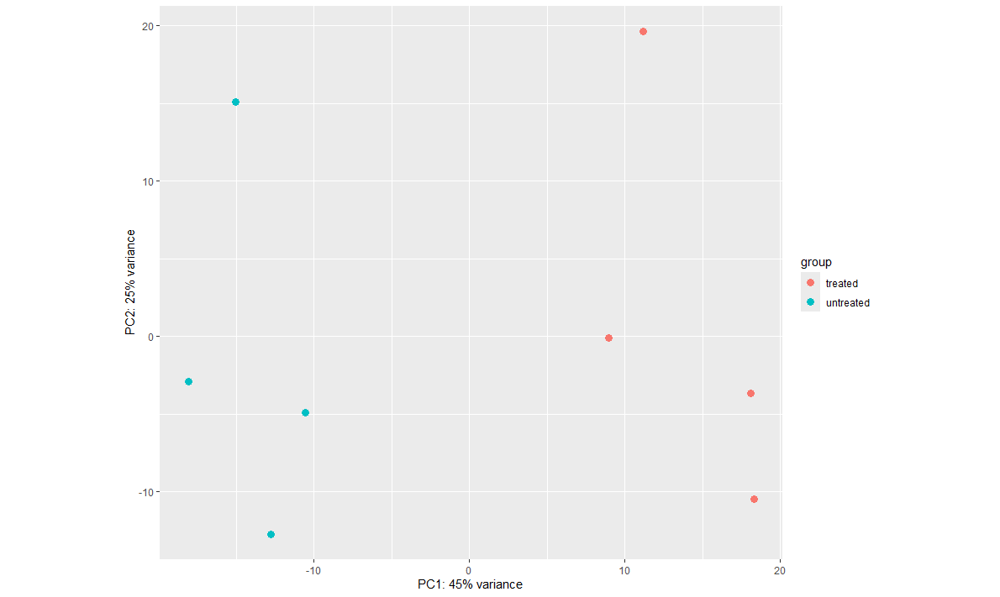
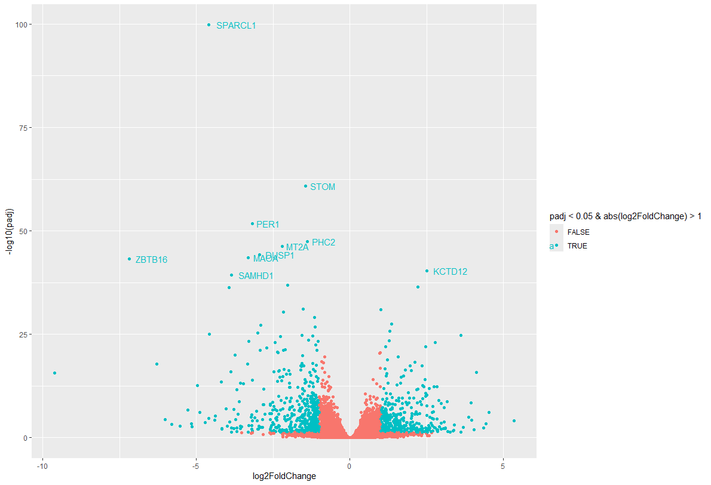
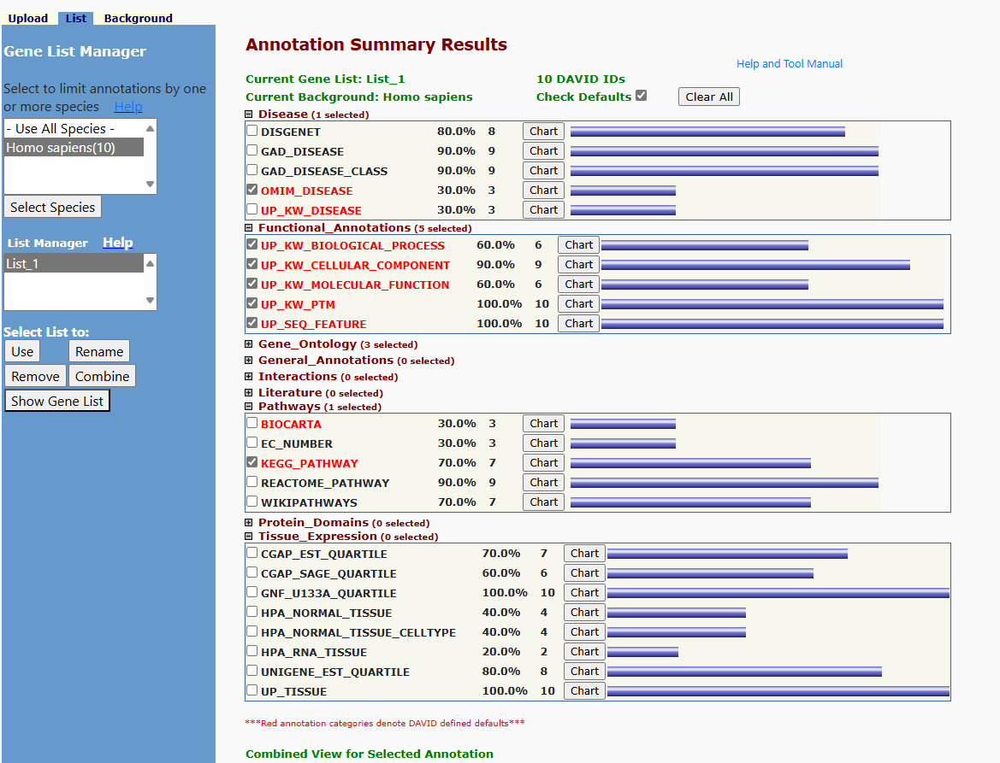
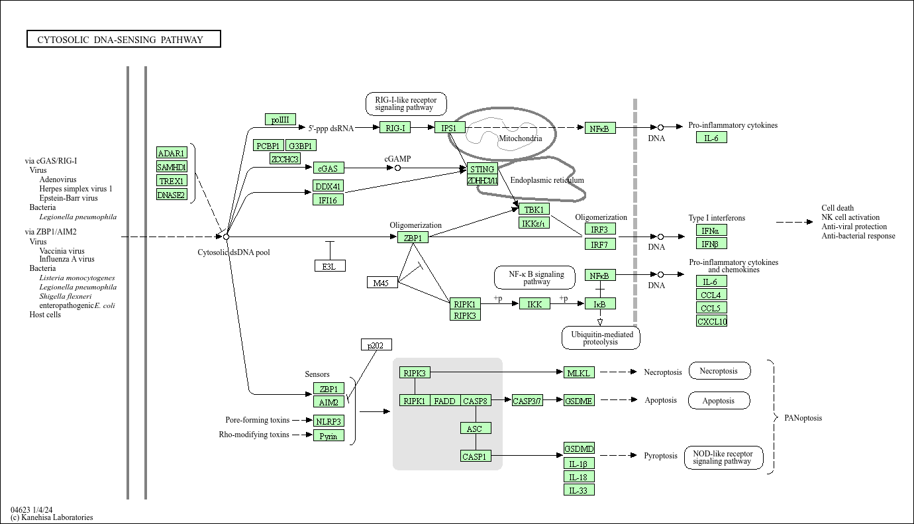

# Differential Expression

## Basic Concepts of DESeq

```R
deg <- DESeq(dds)
```

1. **estimating size factors**
2. estimating dispersions
3. gene-wise **dispersion estimates**
4. mean-dispersion relationship
5. final dispersion estimates
6. **fitting model and testing**

##  Quality Check 

1. PCA

```R
vsd <- vst(deg, blind = FALSE)
plotPCA(vsd, intgroup = "dexamethasone")
```



2. Inspecting Size Factor

​	Check whether one sample is sequenced more/less deeply than the other.

```R
sizeFactors(deg)

output: 
SRR1039508 SRR1039509 SRR1039512 SRR1039513 SRR1039516 SRR1039517 SRR1039520 SRR1039521 
 1.0236476  0.8961327  1.1795171  0.6700291  1.1776714  1.3990527  0.9208046  0.9445520 
```


3. Dispersion Plot

```R
plotDispEsts(deg)

```


The dispersion plot, typically with the final dispersion estimates shrunk from the gene-wise estimates

towards the fitted estimate. As you know it very well that the red line which is here in the center of the plot, is a fitted curve. So normally the gene dispersion should be shrunk towards this future line.

If this fitted line is not showing a downward trend, that it means that there is some abnormality in

the data and we need to check it out.

Once again, if the red line is showing the downward trend, then this is a good indication that we

have a good differential expression of the genes data.


## Analysis


### Mean-Average (MA) Plot


The blue dots are actually those genes having a projected value less than 0.05. This means that these are the genes that actually have the differential expression of the genes between the samples.

Some of the dots are present at the upper and the lower quadrants of the plot. These dots represent those genes with a higher differential expression of their genes among the samples. It means that these genes are interesting candidates for us.


###  Getting Idea About Best Genes

The smaller the adjusted value the more highly the differentially expressed genes will be.

### Volcano Plot




### Heatmap


The blue color indicates the low expression of the genes, while the red color indicates the high expression of the genes.

These genes show a low expression in these samples, while the same genes show a high level of the expression in another sample that are used in the study.

### Pathway Analysis

[DAVID Functional Annotation Tools (ncifcrf.gov)](https://david.ncifcrf.gov/tools.jsp)

| Best genes |
| ---------- |
| SPARCL1    |
| STOM       |
| PER1       |
| PHC2       |
| MT2A       |
| DUSP1      |
| MAOA       |
| ZBTB16     |
| KCTD12     |
| SAMHD1     |


Check the Omnium disease: genes are associated with any particular disease or not.



In Gene_Ontology, only BP, CC and MF are selected.

BP stands for what the BP stands for, the biological processes.

CC stands for, the cellular compartment.

MF stands for the molecular function.


